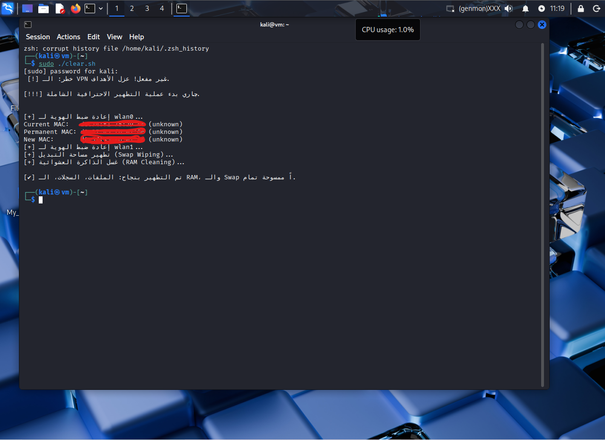

# 🛡️ Advanced Anti-Forensics & System Sanitization (Bash)

This repository contains a professional Bash script designed for automated system cleaning and anti-forensic measures. It ensures that sensitive data, network logs, and session traces are securely wiped after security operations.

---

## 👨‍💻 About the Developer 
Sendid Abderaouf
I am Cybersecurity enthusiast and an **ISC2 Candidate** dedicated to building secure and efficient automation tools.

### 📜 Professional Certifications
* **ISC2:** Certified ISC2 Candidate.https://www.credly.com/badges/20f257e0-af1c-4ff4-8cb4-f2443229b77d/public_url
* **Cisco:** Introduction to Cybersecurity.https://www.credly.com/badges/287b2ee6-cff8-4d87-ad7c-c494ad518ccf/public_url
* **IBM:** Cybersecurity Fundamentals.https://www.credly.com/badges/e80a886c-352e-4c89-9374-f1c222fab989/public_url

---

## 🛠️ The Script: `clear.sh`

Below is the optimized and documented version of the script. [cite_start]It maintains the original logic [cite: 1, 8] while enhancing readability and structure.

```bash
#!/bin/bash

# --- [ Target Configuration ] ---
# [cite_start]Defines the specific wireless interfaces to be reset 
TARGETS=("wlan0" "wlan1")

# --- [ Color Definitions ] ---
RED='\033[0;31m'
GREEN='\033[0;32m'
BLUE='\033[0;34m'
NC='\033[0m' 

function perform_full_wipe {
    echo -e "\n${RED}[!!!] Starting Professional Full Wipe Operation...${NC}"

    # 1. Sensitive Data Destruction (10-Pass Shredding)
    # Securely deletes capture files and cracked data to prevent recovery 
    echo -e "${BLUE}[+] Shredding sensitive files...${NC}"
    sudo shred -u -n 10 ioom_capture* cracked.json *.cap *.netxml 2>/dev/null

    # 2. Network Interface Restoration
    # Resets MAC addresses to permanent values and sets mode to managed [cite: 2]
    for iface in "${TARGETS[@]}"; do
        echo -e "${BLUE}[+] Resetting identity for $iface...${NC}"
        sudo ip link set "$iface" down 2>/dev/null
        sudo macchanger -p "$iface" 2>/dev/null
        sudo iwconfig "$iface" mode managed 2>/dev/null
        sudo ip link set "$iface" up 2>/dev/null
    done

    # 3. Swap Space Wiping
    # Disables swap and overwrites it with zeros to clear memory residue [cite: 3, 4]
    echo -e "${BLUE}[+] Performing Swap Wiping...${NC}"
    sudo swapoff -a 2>/dev/null
    sudo dd if=/dev/zero of=/swapfile bs=1M count=512 status=none 2>/dev/null || true
    sudo swapon -a 2>/dev/null

    # 4. Log Cleansing & Timestamp Forging
    # Truncates system logs and matches their timestamps with /bin/ls for stealth [cite: 5, 6]
    echo -e "${BLUE}[+] Cleaning system logs...${NC}"
    logs=( "/var/log/auth.log" "/var/log/syslog" "/var/log/messages" "/var/log/kern.log" )
    for log in "${logs[@]}"; do
        if [ -f "$log" ]; then
            sudo truncate -s 0 "$log"
            sudo touch -r /bin/ls "$log"
        fi
    done
    sudo journalctl --vacuum-time=1s > /dev/null 2>&1

    # 5. RAM Cache Cleaning
    # Forces the kernel to flush buffer and cache memory [cite: 7]
    echo -e "${BLUE}[+] Flushing RAM caches...${NC}"
    sudo sync && echo 3 | sudo tee /proc/sys/vm/drop_caches > /dev/null

    # 6. Command History Destruction
    # Disables history file for current session and shreds existing history [cite: 7]
    echo -e "${BLUE}[+] Purging command history...${NC}"
    export HISTFILE=/dev/null
    history -c
    sudo shred -u -n 10 ~/.bash_history 2>/dev/null

    echo -e "\n${GREEN}[✔] Wipe Successful: Files, Logs, RAM, and Swap are cleared.${NC}"
}

# --- [ Security Check & Execution ] ---
# Checks if the primary interface is a VPN (tun0). [cite_start]If not, it isolates targets 
IFACE=$(ip route | grep default | awk '{print $5}')

if [[ "$IFACE" != "tun0" ]]; then
    echo -e "${RED}[!] WARNING: VPN is NOT active! Isolating targets...${NC}"
    for iface in "${TARGETS[@]}"; do
        sudo nmcli device disconnect "$iface" 2>/dev/null
    done
    perform_full_wipe
    exit 1
else
    echo -e "${GREEN}[✔] VPN is active. Starting routine cleanup...${NC}"
    perform_full_wipe
fi
TO run this tool on your kali lunix system follow these steps
1. Clone the repository:
git clone https://github.com/anisdell2010-crypto/AntiForensics-Automation-Tool.git
cd AntiForensics-Automation-Tool
2. Give execution permissions:
chmod +x clear.sh
run the script with sudo privileges:
sudo ./clear.sh

#### ✅ Successful Execution in Kali Linux
Once the script is executed, it secures the network interfaces and wipes system traces as shown below:


